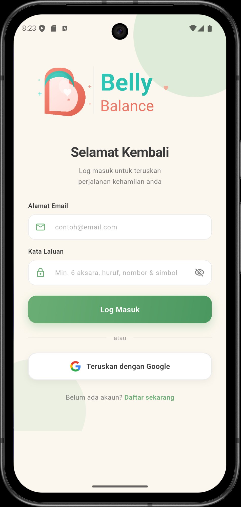
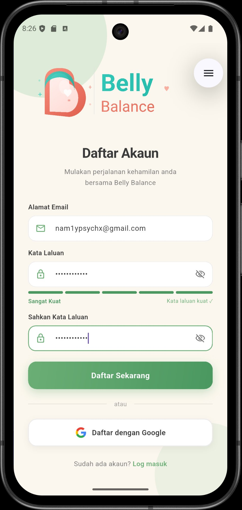
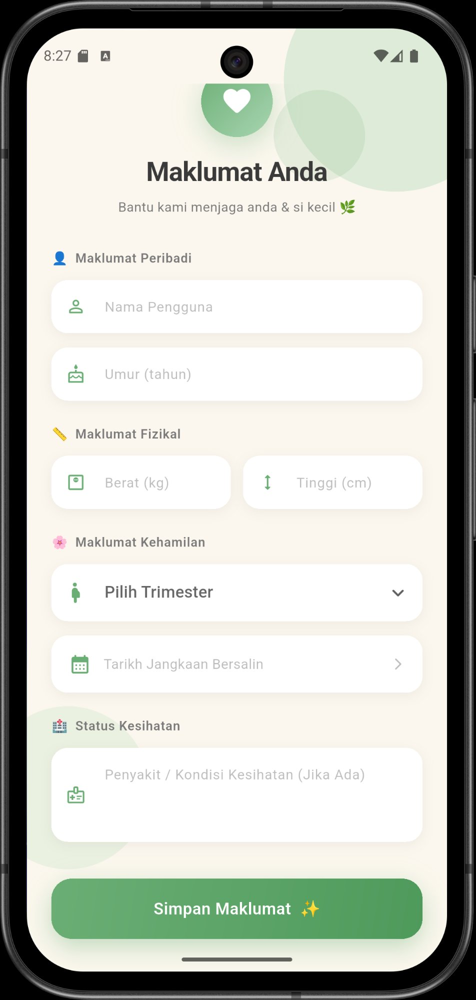
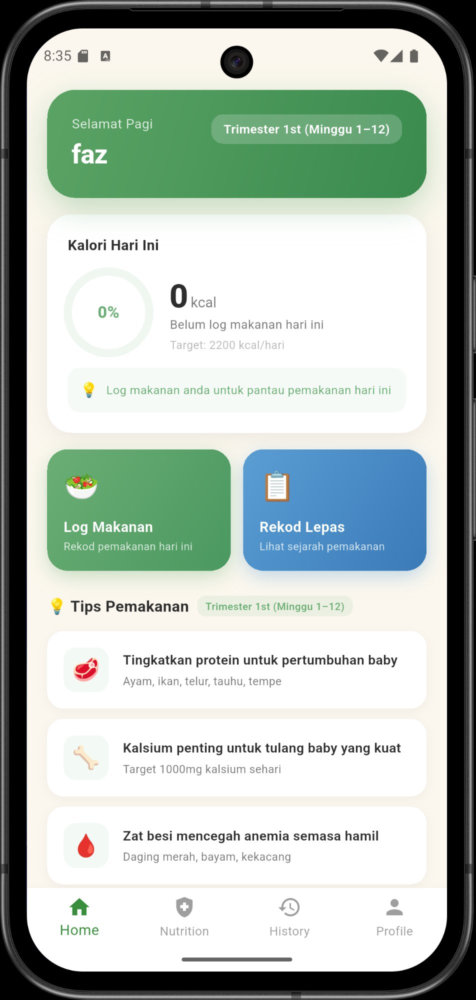
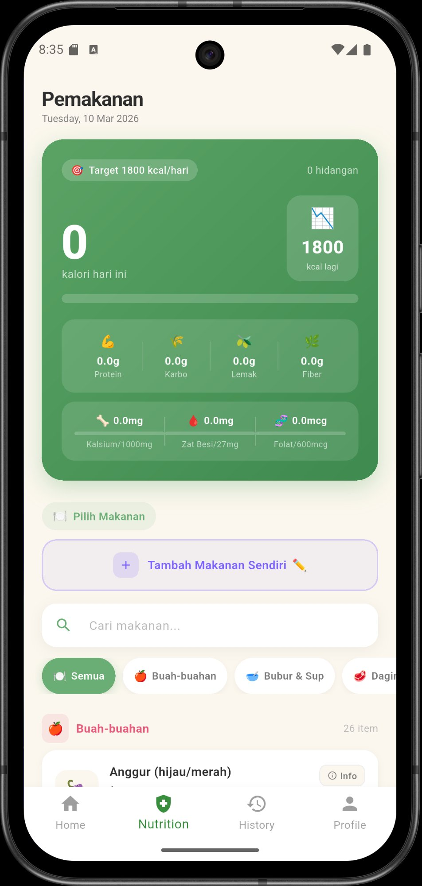
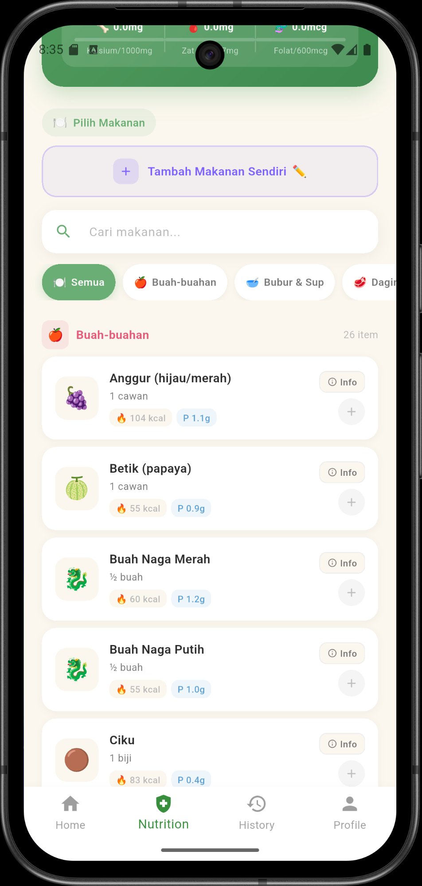
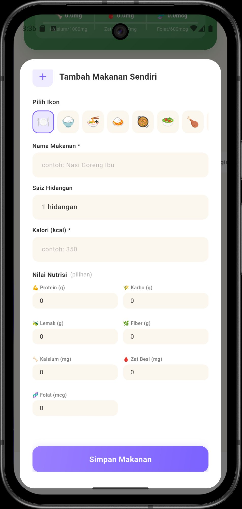
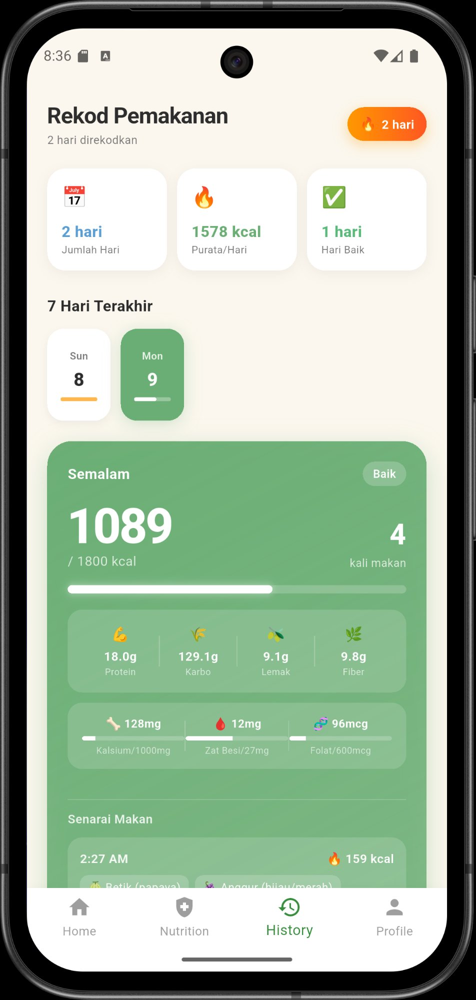
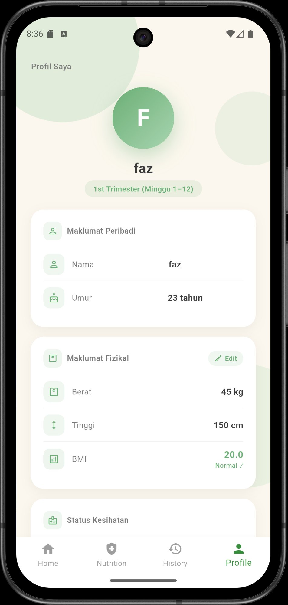

# 🌿 Belly Balance

> Aplikasi pemakanan harian untuk ibu hamil — direka khas untuk membantu ibu mengandung di Malaysia memantau kalori dan nutrisi penting sepanjang kehamilan.

<br>

## 📱 Screenshots

<table>
  <tr>
    <td align="center"><b>Log Masuk</b></td>
    <td align="center"><b>Daftar Akaun</b></td>
    <td align="center"><b>Setup Profil</b></td>
  </tr>
  <tr>
    <td></td>
    <td></td>
    <td></td>
  </tr>
  <tr>
    <td align="center"><b>Halaman Utama</b></td>
    <td align="center"><b>Log Pemakanan</b></td>
    <td align="center"><b>Senarai Makanan</b></td>
  </tr>
  <tr>
    <td></td>
    <td></td>
    <td></td>
  </tr>
  <tr>
    <td align="center"><b>Tambah Makanan</b></td>
    <td align="center"><b>Rekod Pemakanan</b></td>
    <td align="center"><b>Profil</b></td>
  </tr>
  <tr>
    <td></td>
    <td></td>
    <td></td>
  </tr>
</table>

<br>

## ✨ Features

- 🔐 **Autentikasi** — Daftar & log masuk dengan emel/kata laluan atau Google Sign-In
- 🥗 **Log Pemakanan** — Pilih makanan dari database 350+ makanan Malaysia & log hidangan harian
- 🍽️ **Makanan Sendiri** — Tambah, edit & padam makanan custom ikut citarasa sendiri
- 📊 **Ringkasan Kalori** — Pantau kalori harian vs target mengikut trimester (T1: 1800 / T2: 2200 / T3: 2400 kcal)
- 💊 **Nutrisi Penting** — Track protein, karbohidrat, lemak, fiber, kalsium, zat besi & folat
- 📋 **Rekod Lepas** — Semak sejarah pemakanan, streak harian & analisis mingguan
- 👤 **Profil** — Kemaskini berat & tinggi, kira BMI secara automatik
- 💡 **Tips Pemakanan** — Cadangan pemakanan ikut trimester

<br>

## 🛠️ Tech Stack

| | |
|---|---|
| **Framework** | Flutter (Dart) |
| **Backend** | Firebase Firestore |
| **Auth** | Firebase Authentication + Google Sign-In |
| **State Management** | Provider |
| **Font** | Poppins |

<br>

## 📂 Project Structure

```
lib/
├── main.dart
├── pages/
│   ├── home_page.dart
│   ├── nutrition_page.dart
│   ├── history_page.dart
│   ├── profile_page.dart
│   ├── login_page.dart
│   └── signup_page.dart
├── providers/
│   └── user_provider.dart
├── services/
│   └── auth_service.dart
└── wrappers/
    └── main_wrapper.dart
```

<br>

## 🚀 Getting Started

### Prerequisites
- Flutter SDK `>=3.0.0`
- Firebase project dengan Firestore & Authentication diaktifkan

### Setup

```bash
# Clone repo
git clone https://github.com/faz36/belly_balance_app.git
cd belly_balance_app

# Install dependencies
flutter pub get

# Run app
flutter run
```

> ⚠️ **Note:** Kena setup `google-services.json` sendiri dari Firebase Console dan letak dalam `android/app/`.

<br>

## 🗄️ Database

Food database mengandungi **350+ makanan Malaysia** merangkumi 21 kategori:

Nasi & Bijirin · Lauk-pauk · Daging & Protein · Ikan & Seafood · Sayur-sayuran · Buah-buahan · Tenusu & Susu · Fast Food Malaysia · Dessert & Kuih · dan banyak lagi

<br>

## 👩‍💻 Developer

**Faz** — [@faz36](https://github.com/faz36)

<br>

---

<p align="center">Dibuat dengan ❤️ untuk ibu-ibu hamil Malaysia</p>
